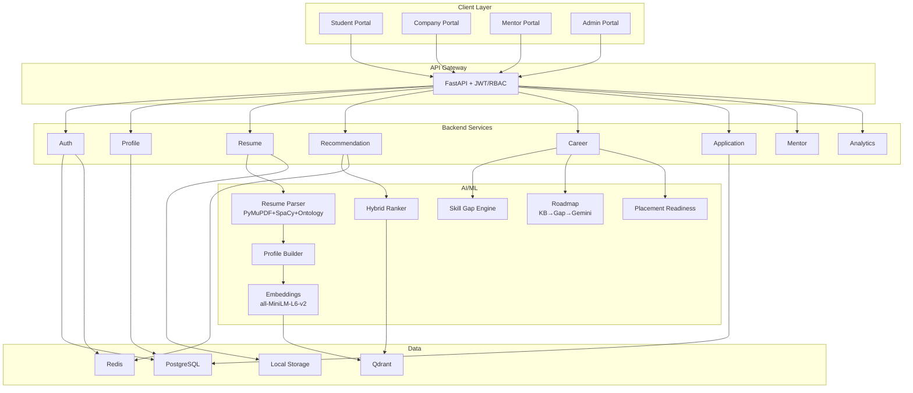

# SkillBridge AI — Implementation Plan v2

## Changes from v1 (per user feedback)

- **LLM**: Gemini 2.5 Flash (dev) / Pro (advanced) — only for roadmap, resume feedback, copilot
- **Storage**: Local filesystem first (`backend/storage/`), MinIO later
- **OAuth**: Google OAuth only for MVP
- **Deploy**: Docker Compose (dev), Vercel + Railway + Supabase + Qdrant Cloud (prod)
- **Seed Data**: Generate 1000 students, 500 jobs, 500 internships, 100 mentors, 300 courses
- **Added**: Career Knowledge Base tables, study_groups, mentor_requests, recommendation_events
- **Added**: Split recommenders, Skill Ontology, Profile Builder, Placement Readiness Engine
- **Improved**: Roadmap Engine (KB → Gap → LLM refinement, not LLM invention)

---

## Architecture



---

## Database Schema (Phase 1)

### New tables added per feedback

| Table | Key Columns | Purpose |
|:---|:---|:---|
| `career_roles` | id, title, description, domain | Knowledge base for roles |
| `role_skills` | role_id, skill_id, importance | Required skills per role |
| `role_projects` | role_id, project_title, difficulty | Suggested projects per role |
| `role_courses` | role_id, course_id, priority | Courses mapped to roles |
| `role_certifications` | role_id, certification_name, priority | Certs per role |
| `study_groups` | id, name, domain, skill_level, owner_id | Peer study groups |
| `mentor_requests` | id, student_id, mentor_id, status | Mentee requests |
| `recommendation_events` | id, student_id, recommendation_id, action, created_at | Analytics tracking |

### Original tables (unchanged)

`users`, `students`, `skills`, `student_skills`, `career_goals`, `student_goals`, `resumes`, `internships`, `jobs`, `mentors`, `courses`, `applications`, `recommendations`

---

## AI Pipeline (Improved)

```
Resume PDF
  ↓
PyMuPDF (text extraction)
  ↓
SpaCy + Skill Ontology (extraction)
  ↓
Profile Builder (structured profile JSON)
  ↓
Embedding (all-MiniLM-L6-v2, 384-dim)
  ↓
Qdrant Storage
  ↓
Recommendation (embedding similarity + business rules)
```

### Skill Ontology

```json
{
  "Python": ["python", "py"],
  "TensorFlow": ["tensorflow", "tf"],
  "FastAPI": ["fastapi", "fast api"],
  "Machine Learning": ["ml", "machine learning"]
}
```

### Split Recommenders

```
recommendation/
├── internship_recommender.py
├── job_recommender.py
├── mentor_recommender.py
├── course_recommender.py
└── studygroup_recommender.py
```

### Roadmap Engine (Improved)

```
Career Goal → Knowledge Base lookup → Skill Gap analysis → Gemini LLM refinement → Roadmap
```

### Placement Readiness Engine

```
Inputs: Skills + Projects + Internships + Resume Score
Output: Score (0-100) with breakdown
```

---

## Phase 1: Infrastructure & Scaffolding (~3 days)

- Docker Compose: PostgreSQL 16, Qdrant, Redis
- Backend: FastAPI project scaffold with full folder structure
- Frontend: Next.js 15 + ShadCN + Tailwind
- All DB models including new knowledge base tables
- Alembic initial migration
- Local storage directories
- Seed data generation script

## Phase 2: Auth & Profiles (~3 days)

- JWT auth (register, login, logout, refresh)
- Google OAuth integration
- RBAC middleware (Student/Mentor/Company/Admin)
- Profile CRUD for all roles
- Auth frontend (login/register pages)

## Phase 3: Resume & AI Pipeline (~4 days)

- Resume upload + local storage
- PyMuPDF + SpaCy + Skill Ontology parser
- Student Profile Builder
- Embedding pipeline + Qdrant storage
- Celery async processing
- Resume frontend (upload, analysis, score)

## Phase 4: Recommendations & Student Portal (~5 days)

- Split recommenders (jobs, internships, mentors, courses, study groups)
- Hybrid ranking (0.40 embedding + 0.25 skill + 0.15 interest + 0.10 popularity + 0.10 activity)
- Skill Gap Engine with Knowledge Base
- Placement Readiness Engine
- Roadmap Engine (KB → Gap → Gemini)
- Recommendation events tracking
- Student Dashboard (all widgets, charts, tabs)
- Career Roadmap timeline UI

## Phase 5: Company, Mentor & Admin Portals (~4 days)

- Company: job posting, candidate search, applications
- Mentor: mentee management, sessions, feedback
- Admin: user management, verification, analytics
- Study groups management

## Phase 6: Polish & Deployment (~3 days)

- Security hardening
- Performance optimization (Redis caching)
- Seed data loading
- Testing (pytest + browser)
- Docker Compose production config
- Deployment configs (Vercel/Railway)

---

## Verification Plan

| Phase | Verification |
|:---|:---|
| 1 | `docker-compose up` succeeds, migrations run, frontend starts |
| 2 | Register → Login → Protected route → Google OAuth |
| 3 | Upload PDF → Skills extracted → Embedding in Qdrant |
| 4 | Recommendations returned with Match % → Skill gap works |
| 5 | Company posts job → Appears in student recommendations |
| 6 | Full E2E flow, all portals functional |
